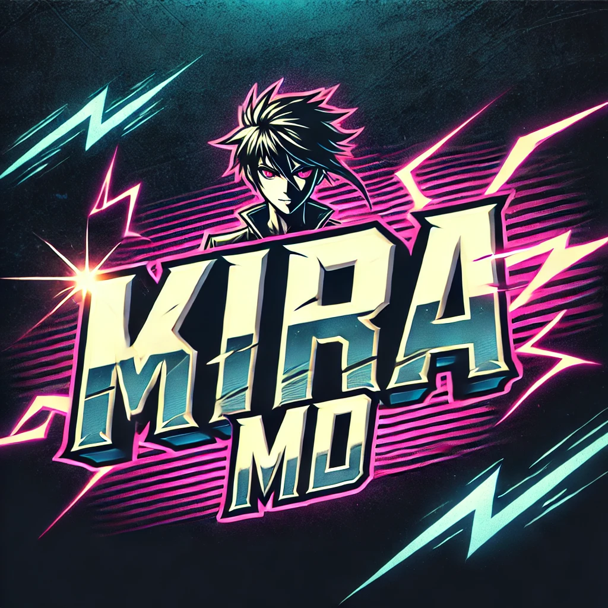

# Kira MD  

  

Kira MD est un bot WhatsApp multi-device basé sur Baileys.  

## 📌 Fonctionnalités  
- Réponse automatique aux messages  
- Commande `!ping` pour tester la connexion  
- Système d’administration  
- Commande anti-lien  
- Téléchargement de vidéos YouTube (`!yt <lien YouTube>`)  
- Gestion des groupes (`!tag`, `!kick`, `!promote`)  
- Messages de bienvenue et d’au revoir  

## 🚀 Installation  

1. **Clonez ce dépôt** :  
   ```sh
   git clone https://github.com/mikaelsonangel844/Kira-MD.git
   cd Kira-MD
